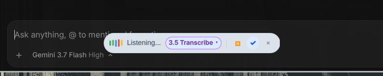

# Omarchy Flow 🌊

> System-wide voice dictation HUD pill and AI speech-to-text / speech-to-action engine for **Omarchy** (Hyprland + Quickshell + Wayland).



---

## ✨ Features

- 🎙️ **Floating Glassmorphic HUD Pill**: High-performance Wayland layer HUD (`Quickshell.Wayland.WlrLayershell`) floating non-intrusively above active windows.
- 🌈 **Dynamic Audio Waveform**: Real-time 5-color animated equalizer visualizer for active voice recording.
- ⚡ **Seamless Speech Models**: On-the-fly switching between local zero-latency Whisper and Google Gemini Cloud reasoning models.
- ⌨️ **System-Wide Keybindings**: Start, toggle, pause, or auto-submit dictation anywhere in your desktop environment.
- 🧩 **Omarchy Bar Widget**: Theme-adaptive Flow mark with live recording state, a full settings menu, and left/right click controls.
- ⚙️ **Settings Hub**: Configure the default model, toggle completion, clipboard behavior, audio input, HUD position, waveform visibility, global shortcuts, diagnostics, and privacy details.
- 🔒 **Secure Credential Resolution**: Automatic API key discovery from environment variables, Secret Service/GNOME Keyring, and private XDG config files.

## 📦 Install

```sh
omarchy plugin add https://github.com/EF-Code/omarchy-flow.git --enable
```

## ⚙️ Configure

```sh
# Place the widget in your bar
omarchy bar move io.github.ef-code.omarchy-flow --section right
```

Left-click the Flow mark to open the action menu. Choose **Settings** to
configure Flow without editing files. The settings hub includes editable
Hyprland shortcuts, a microphone source picker, a short microphone test,
dependency diagnostics, and HUD controls. Right-click remains the quick
recording action.

### Dependencies and credentials

Local models require `ffmpeg`, `voxtype`, `wl-copy`, and `wtype`. Cloud models
require the `google-genai` package in the Python environment used by Flow.
Gemini 3.5 Transcribe requires a current `google-genai` release exposing the
Interactions API. Set `OMARCHY_FLOW_PYTHON` if the default environment is not
the one containing that package.

The backend checks `GEMINI_API_KEY`, then `secret-tool`/GNOME Keyring, then
private XDG config files. If using a file fallback, create
`$XDG_CONFIG_HOME/omarchy-flow/gemini_api_key` (or the default XDG config
directory) with mode `600`. API keys and
transcripts should never be placed in the repository or logs.

The headless service target is
`io.github.ef-code.omarchy-flow.service`; the short
`io.github.ef-code.omarchy-flow` target remains available for compatibility.
The HUD accepts both `io.github.ef-code.omarchy-flow.pill` and the legacy
`geminipill` target.

## 🗑️ Remove

```sh
omarchy plugin remove io.github.ef-code.omarchy-flow
```

---

## 🤖 Supported Models

| Model ID | Provider | Latency | Description |
| :--- | :--- | :--- | :--- |
| `whisper-base.en` | Local (Voxtype / Whisper) | Instant (0 ms API) | Local offline transcription with zero cloud latency. |
| `gemini-3.5-transcribe` | Google Cloud API | Ultra-Fast (~250 ms) | Specialized audio transcription model with ultra-low latency. |
| `gemini-3.7-flash` | Google Cloud API | Balanced (~800 ms) | Flagship reasoning speech understanding. |

---

## 🚀 Keyboard shortcuts

The Settings menu can install and reload a managed Flow shortcut block in your
Hyprland bindings. It leaves the rest of your configuration intact and shows
existing bindings on the selected keys before applying changes.

For manual setup, add the following keybindings to `~/.config/hypr/hyprland.conf`:

```ini
# Omarchy Flow — Voice Dictation Keybindings
# Toggle Voice Dictation (Super + D)
bind = $mainMod, D, exec, ~/.config/omarchy/plugins/io.github.ef-code.omarchy-flow/scripts/flowctl toggle

# Dictate and Auto-Submit with Return (Super + Shift + D)
bind = $mainMod SHIFT, D, exec, ~/.config/omarchy/plugins/io.github.ef-code.omarchy-flow/scripts/flowctl toggle-submit

# Pause / Resume Voice Recording (Super + Alt + D)
bind = $mainMod ALT, D, exec, ~/.config/omarchy/plugins/io.github.ef-code.omarchy-flow/scripts/flowctl pause

# Cancel & Discard Active Recording (Escape while recording)
bind = $mainMod, Escape, exec, ~/.config/omarchy/plugins/io.github.ef-code.omarchy-flow/scripts/flowctl cancel
```

---

## 🛠️ CLI Interface (`flowctl`)

Omarchy Flow includes a standalone CLI dispatcher for shell automation and scripts:

```sh
# Toggle voice dictation recording
./scripts/flowctl toggle

# Record and auto-submit (press Enter after typing)
./scripts/flowctl toggle-submit

# Pause / resume active recording
./scripts/flowctl pause

# Discard recording
./scripts/flowctl cancel

# Query current state (JSON)
./scripts/flowctl status

# Get or set active model
./scripts/flowctl model gemini-3.5-transcribe
./scripts/flowctl model whisper-base.en

# List all available models
./scripts/flowctl list-models
```

---

## 📂 Architecture

- **`Pill.qml`**: Floating liquid-glass HUD pill overlay (`WlrLayer.Overlay`).
- **`BarWidget.qml`**: Status bar widget with reactive status indicator.
- **`SettingsView.qml`**: Settings hub for behavior, shortcuts, audio/privacy, HUD, diagnostics, and about information.
- **`Service.qml`**: Background Quickshell service hosting the system IPC target.
- **`scripts/gemini-dictate.py`**: Audio recording, local VAD, Whisper / Gemini transcription engine.
- **`scripts/flowctl`**: Command-line dispatcher and Hyprland keybinding endpoint.
- **`manifest.json`**: Omarchy plugin manifest.

---

## 🧪 Testing & Validation

```sh
# Run full automated validation suite
bash tests/run.sh
```

The suite validates the manifest, installed Omarchy QML imports, backend state
and transcription dispatch, isolated XDG paths, CLI argument handling, Python
syntax, portability, and shell scripts. It does not start a real recorder,
send audio to Google, or type into the focused application.

---

## 📄 License

MIT © [EF-Code](https://github.com/EF-Code)
